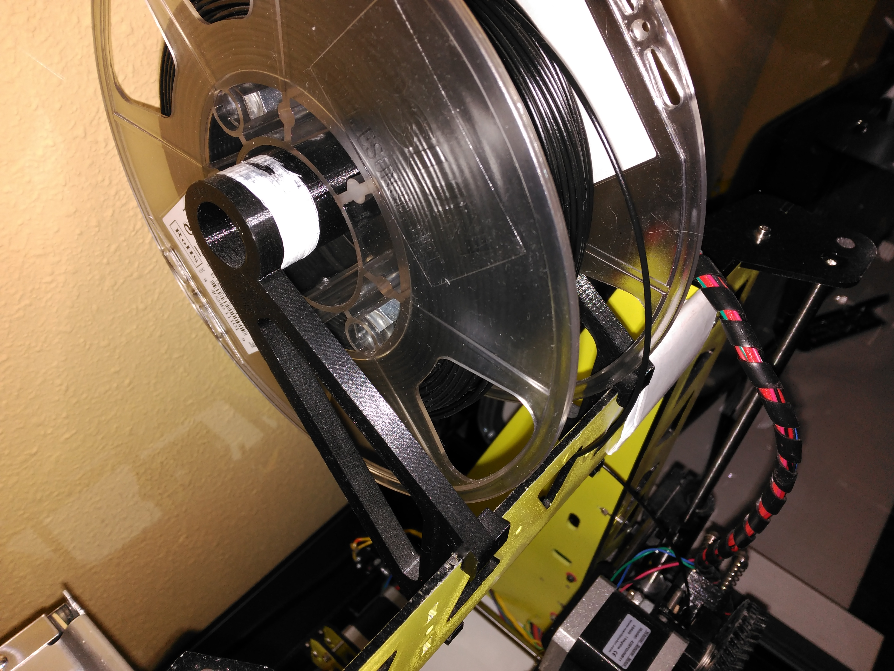
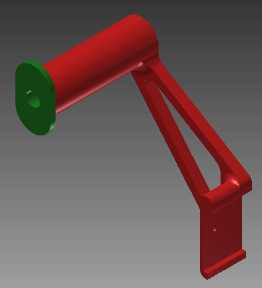
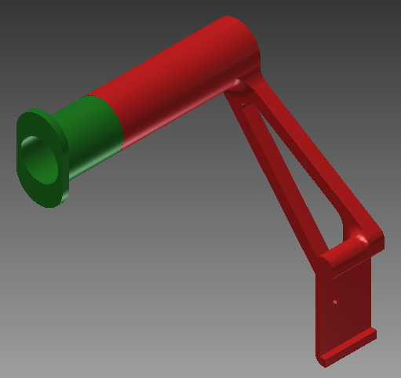
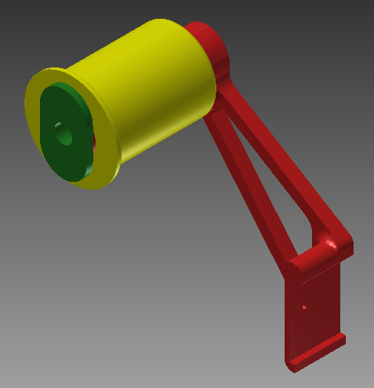

# Prusa i3 Steel filament holder

Version #1:

Version #2:

This design has some configurations for each type of filament coil, depending on the dimensions (diameter = 30 or 55 mm; width = 70 or 100 mm).

## Author
[Rubén Espino San José](https://github.com/Resaj)
